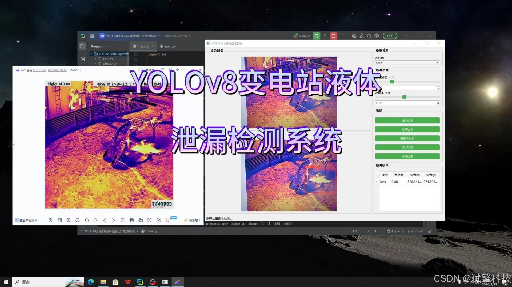
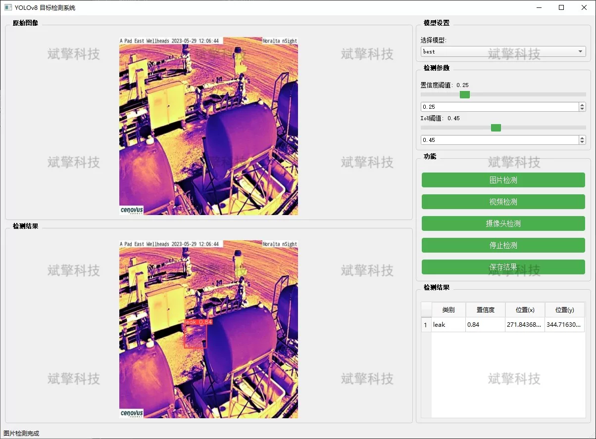
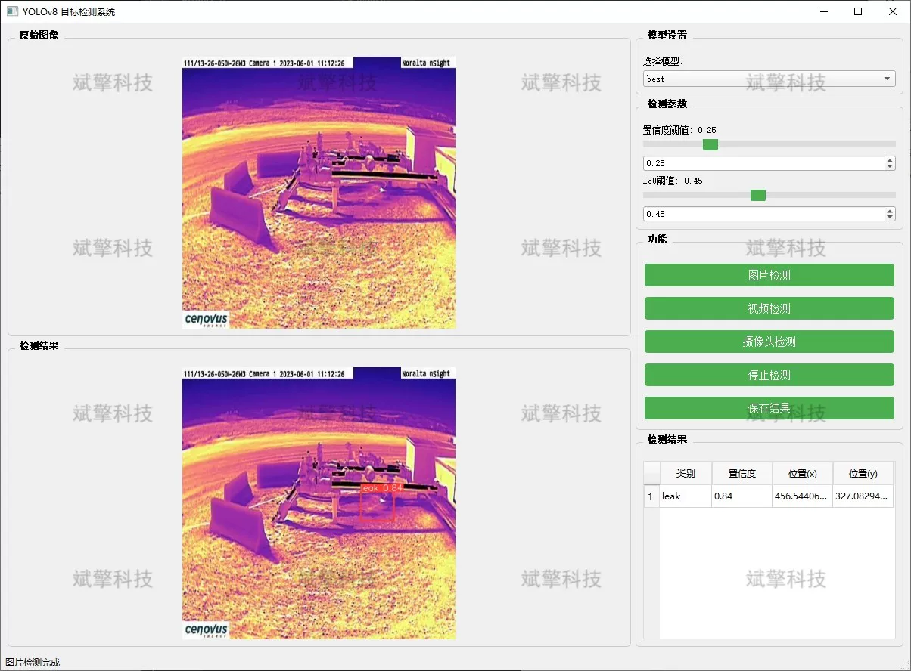
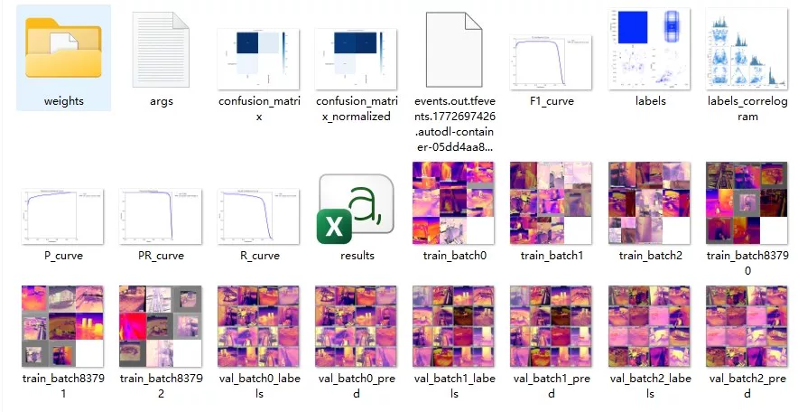
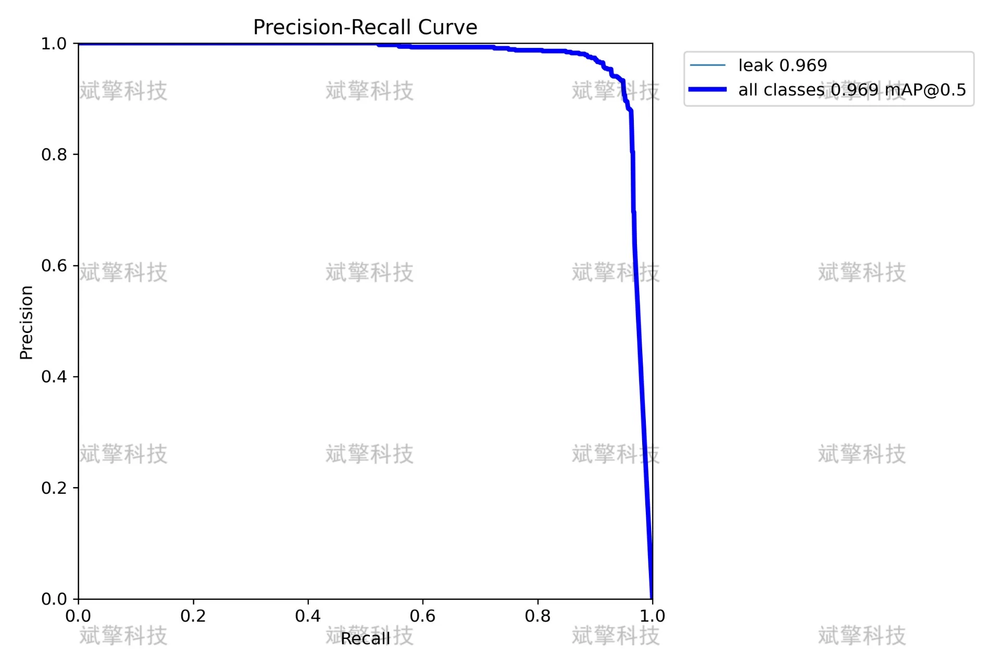
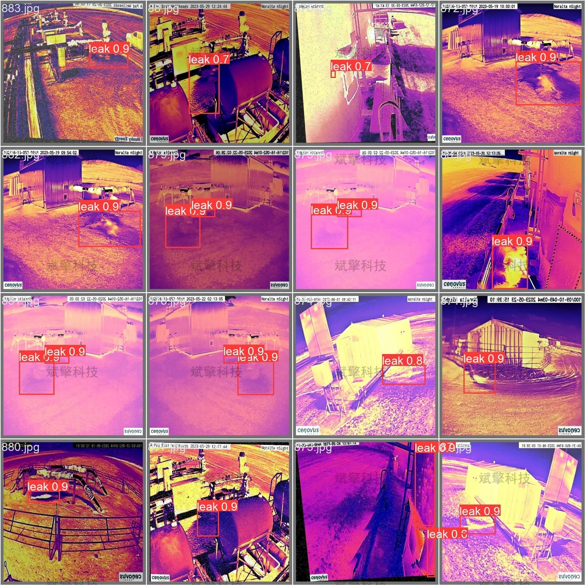

# YOLOv8 Substation Leakage Detection System

## Body

The YOLOv8 Substation Leakage Detection System, based on the YOLOv8 deep learning architecture, is an infrared detection system for liquid leakage in substations. As the core hub of the power system, substations contain oil-filled equipment (such as transformers, reactors, bushings, etc.) that can suffer from liquid leakage problems. If not detected in time, these issues can lead to equipment failure and serious safety accidents. To address the low efficiency and difficulty in detecting early minor leaks of traditional manual inspections, this project proposes and implements an infrared detection system based on the YOLOv8 deep learning architecture. This system utilizes infrared thermal imaging technology to capture abnormal temperature fields in equipment, combined with the outstanding target detection and real-time processing capabilities of the YOLOv8 algorithm, to accurately identify and locate leakage areas in images, videos, and real-time camera streams. Experimental results show that this system has high accuracy and recall rates in complex backgrounds, providing a highly efficient and reliable solution for unmanned inspections and intelligent operation and maintenance of substations.

System Features:
✅ Image Detection: Can detect images and return detection boxes and category information.

✅ Video Detection: Supports video file input, detecting each frame in the video.

✅ Real-time Camera Detection: Connects USB cameras to achieve real-time monitoring.

✅ Parameter Real-Time Adjustment (Confidence and IoU Thresholds)

Dataset Overview:
Training set: 3524 images.
Validation set: 504 images.
Test set: 1007 images.

## Images

## Payment

Here is a pay link on Stripe ( https://buy.stripe.com/3cs8yP7sY87d0vu9AB ). Please contact me lonlonago@foxmail.com after funding $89, and I will send you a complete data files , thank you!

